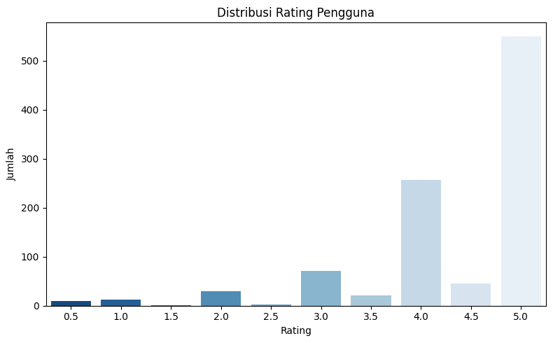
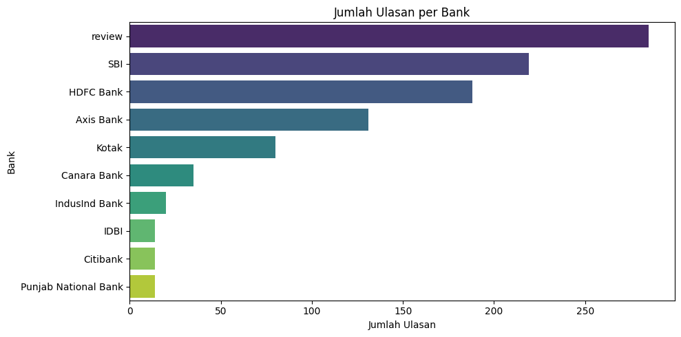
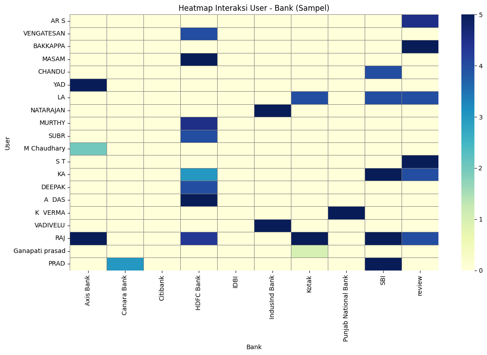

# Laporan Proyek Machine Learning - PUTRA ADE NIRADA
**Nama:** PUTRA ADE NIRADA

**ID Dicoding:** putraade

---

## Project Overview

Dalam industri perbankan yang serba cepat dan dinamis, calon nasabah seringkali dihadapkan pada **_choice overload_** akibat banyaknya pilihan bank dan layanan yang tersedia. Fenomena ini dapat mengurangi kepercayaan diri dan kepuasan mereka dalam membuat keputusan finansial yang penting [1].

Pentingnya proyek ini terletak pada **manfaat timbal balik** yang diberikannya, baik bagi nasabah maupun institusi perbankan. Bagi nasabah, sistem rekomendasi ini menyederhanakan proses pencarian, memfasilitasi penemuan bank yang relevan dengan preferensi personal, meningkatkan pengalaman pengguna secara keseluruhan, serta memperkenalkan layanan perbankan baru yang mungkin belum mereka sadari. Sementara itu, bagi bank, algoritma rekomendasi berpotensi **meningkatkan keterlibatan nasabah, membangun loyalitas, dan mendukung akuisisi nasabah baru**. Hal ini pada gilirannya akan berdampak positif pada metrik bisnis kunci seperti pertumbuhan jumlah nasabah dan tingkat retensi pengguna.

Penelitian sebelumnya telah menunjukkan bahwa **ulasan pelanggan merupakan fondasi yang kokoh untuk sistem rekomendasi**, karena secara akurat merefleksikan pengalaman dan preferensi otentik pengguna [2]. Proyek ini memanfaatkan "**Banks Reviews Customer Dataset**," sebuah kumpulan data ekstensif yang berisi ulasan dan peringkat pelanggan bank. Dataset yang kredibel ini menyediakan wawasan mendalam mengenai tingkat kepuasan pelanggan, tren regional, dan faktor-faktor kunci yang membentuk pengalaman perbankan. Pemanfaatan dataset ini memungkinkan pengembangan model rekomendasi yang representatif dan relevan.

### **Referensi**

[1] "Banks Reviews Customer Dataset," [Online]. Available: [Bank Reviews Dataset, Kaggle]. [Accessed: [Tanggal Akses, misal: 17 Juni 2025]].
[2] Anu Taneja*, and Anuja Arora, "A Comparison Evaluation of Demographic and Contextual Information of Movies using Tensor Factorization Model" *Int J Performability Eng,Vol. 15, Issue (9): 2305-2317. 2019, 

---

## Business Understanding

### Problem Statements

Dalam industri perbankan yang semakin padat, calon nasabah dihadapkan pada **jumlah pilihan bank dan produk yang sangat banyak**, seringkali menyebabkan kebingungan dan kesulitan dalam membuat keputusan yang tepat. 
Fenomena ini, yang dikenal sebagai *choice overload*, dapat mengurangi kepercayaan diri nasabah dan potensi kepuasan mereka. Secara spesifik, masalah yang ingin diatasi proyek ini adalah:

1.  **Kesulitan Calon Nasabah dalam Menemukan Bank yang Sesuai:** Dengan ribuan bank dan beragam layanan yang tersedia, calon nasabah kesulitan untuk menyaring informasi dan mengidentifikasi bank yang paling cocok dengan kebutuhan, preferensi, dan profil risiko mereka. Ini membuang waktu dan dapat berujung pada pilihan yang kurang optimal.
2.  **Kurangnya Personalisasi dalam Penawaran Bank:** Saat ini, banyak penawaran bank bersifat umum, tidak mempertimbangkan preferensi individu nasabah. Hal ini menyebabkan rendahnya relevansi penawaran dan kurangnya keterlibatan nasabah terhadap produk atau layanan bank.

### Goals

Berdasarkan pernyataan masalah di atas, tujuan utama proyek ini adalah mengembangkan sistem rekomendasi yang dapat mengatasi tantangan tersebut dan memberikan nilai tambah bagi calon nasabah maupun industri perbankan. Tujuan yang ingin dicapai adalah:

1.  **Memudahkan Calon Nasabah dalam Mengidentifikasi Bank Ideal:** Menyediakan sistem yang secara otomatis dapat merekomendasikan bank-bank yang paling sesuai dengan preferensi individu calon nasabah, berdasarkan pola ulasan dan rating dari pengguna lain.
2.  **Meningkatkan Relevansi Penawaran Bank Melalui Personalisasi:** Mengembangkan model yang mampu memberikan rekomendasi bank yang sangat personal, sehingga calon nasabah merasa lebih terhubung dengan pilihan yang disajikan dan meningkatkan potensi akuisisi.

### Solution Approach

Untuk mencapai tujuan yang telah ditetapkan, proyek ini akan mengeksplorasi dan membandingkan kinerja tiga pendekatan *machine learning* yang berbeda dalam membangun sistem rekomendasi berbasis *Collaborative Filtering*. Evaluasi kinerja model akan menggunakan **Mean Absolute Error (MAE)** dan **Top-N Recommendation Evaluation** untuk mengukur akurasi prediksi.

#### Solution Statements

1.  **Model 1 – User-Based Collaborative Filtering (Cosine Similarity):**
    * **Pendekatan:** Model ini akan mengidentifikasi pengguna dengan preferensi serupa (tetangga terdekat) berdasarkan rating ulasan mereka terhadap bank yang sama. Setelah itu, rekomendasi bank akan diberikan kepada pengguna target berdasarkan bank-bank yang disukai oleh tetangga terdekatnya. Metode *Cosine Similarity* akan digunakan untuk mengukur kemiripan antar pengguna.
    * **Dasar Pemikiran:** Pendekatan ini relatif sederhana dan intuitif, memanfaatkan "wisdom of the crowd" untuk menemukan item yang relevan.

2.  **Model 2 – SVD (Singular Value Decomposition) Matrix Factorization Manual:**
    * **Pendekatan:** SVD adalah teknik dekomposisi matriks yang akan digunakan untuk mengurangi dimensi matriks ulasan pengguna-bank yang jarang (sparse) menjadi representasi laten (faktor tersembunyi). Dengan demikian, preferensi pengguna dan karakteristik bank dapat diwakili oleh sejumlah kecil faktor laten, yang kemudian digunakan untuk memprediksi rating yang hilang.
    * **Dasar Pemikiran:** SVD efektif dalam menangani masalah *sparsity* dan menemukan pola tersembunyi dalam data, seringkali menghasilkan prediksi yang lebih akurat dibandingkan metode berbasis tetangga.

3.  **Model 3 – Neural Collaborative Filtering (NCF):**
    * **Pendekatan:** NCF merupakan pendekatan berbasis *deep learning* yang menggantikan fungsi interaksi matriks tradisional dengan arsitektur jaringan saraf tiruan (neural network). Model ini memungkinkan pemodelan interaksi yang lebih kompleks dan non-linear antara pengguna dan item, berpotensi menangkap pola preferensi yang lebih kaya.
    * **Dasar Pemikiran:** NCF menawarkan fleksibilitas yang lebih besar dalam memodelkan interaksi pengguna-item, berpotensi melampaui linearitas metode tradisional dan mencapai akurasi yang lebih tinggi, terutama dengan dataset yang besar dan kompleks.

Perbandingan ketiga model ini akan memberikan pemahaman mendalam tentang pendekatan mana yang paling efektif dalam merekomendasikan bank di dataset "Banks Reviews Customer Dataset" berdasarkan metrik MAE dan Top-N Recommendation Evaluation, serta memberikan dasar untuk memilih model terbaik untuk implementasi.

---

## Data Understanding

Bagian ini membahas informasi mendetail mengenai dataset yang digunakan dalam proyek sistem rekomendasi bank ini. Proyek ini menggunakan **"Banks Reviews Customer Dataset"** yang dapat diunduh melalui platform Kaggle: [https://www.kaggle.com/datasets/dhavalrupapara/banks-customer-reviews-dataset](https://www.kaggle.com/datasets/dhavalrupapara/banks-customer-reviews-dataset). 

Dataset ini merupakan kumpulan ulasan dan peringkat pelanggan bank yang luas, berisi lebih dari **1000 data ulasan dan rating** yang dibuat oleh pengguna untuk berbagai bank. Dataset ini berfungsi sebagai aset berharga bagi ilmuwan data, peneliti, dan profesional perbankan, menyediakan pandangan komprehensif mengenai kepuasan pelanggan, tren perbankan regional, serta faktor-faktor yang membentuk pengalaman perbankan melalui umpan balik pelanggan asli.

### Variabel dalam Dataset

Dataset "Banks Reviews Customer Dataset" umumnya terdiri dari beberapa variabel kunci yang merepresentasikan interaksi antara pelanggan dan bank. Meskipun struktur kolom spesifik mungkin bervariasi, berdasarkan deskripsi, variabel-variabel yang diharapkan ada dan relevan untuk analisis adalah sebagai berikut:

* **`User_ID`**: Identifier unik untuk setiap pelanggan yang memberikan ulasan. Variabel ini krusial untuk mengidentifikasi perilaku dan preferensi pengguna.
* **`Bank_Name`**: Nama bank yang diulas oleh pelanggan. Ini adalah item yang akan direkomendasikan dalam sistem.
* **`Rating`**: Peringkat numerik yang diberikan oleh pelanggan kepada bank (misalnya, skala 1-5). Variabel ini adalah target prediksi utama untuk model rekomendasi.
* **`Review_Text`**: Teks ulasan yang ditulis oleh pelanggan. Meskipun tidak langsung digunakan dalam model *collaborative filtering* berbasis rating, ini bisa menjadi sumber insight tambahan untuk analisis sentimen atau *Natural Language Processing* (NLP) di masa depan.
* **`Date`**: Tanggal ulasan dibuat, berguna untuk analisis tren temporal.
* **`Location/Region`** (Opsional, jika tersedia): Lokasi geografis bank atau pelanggan, yang dapat memberikan wawasan tentang tren regional.


### Struktur Data dan Eksplorasi Awal

Untuk mendapatkan pemahaman yang lebih mendalam tentang data, beberapa langkah eksplorasi awal akan dilakukan:

#### 1. Analisis Deskriptif

Analisis deskriptif akan memberikan gambaran umum tentang statistik kunci dari dataset, seperti jumlah total ulasan, rentang rating, dan distribusi data pada kolom-kolom numerik. Ini membantu mengidentifikasi karakteristik dasar data.
Berikut merupakan info dari dataset bank reviews : 
| # | Column               | Non-Null Count | Dtype   | Keterangan                                                                   |
|---|----------------------|----------------|---------|------------------------------------------------------------------------------|
| 0 | **author** | 996 non-null   | `object` | Nama pengguna yang menulis ulasan. Terdapat 4 nilai yang hilang.            |
| 1 | **date** | 1000 non-null  | `object` | Tanggal ulasan dipublikasikan.                                                |
| 2 | **address** | 1000 non-null  | `object` | Alamat atau lokasi terkait ulasan (kemungkinan lokasi cabang bank).        |
| 3 | **bank** | 1000 non-null  | `object` | Nama bank yang diulas. Ini akan menjadi `Bank_Name` yang kita gunakan.      |
| 4 | **rating** | 1000 non-null  | `float64`| Rating numerik yang diberikan oleh pengguna untuk bank tersebut (skala 1-5). |
| 5 | **review_title_by_user** | 1000 non-null  | `object` | Judul ulasan yang diberikan oleh pengguna.                                    |
| 6 | **review** | 1000 non-null  | `object` | Isi teks ulasan lengkap yang ditulis oleh pengguna.                          |
| 7 | **bank_image** | 1000 non-null  | `object` | URL atau referensi gambar bank.                                              |
| 8 | **rating_title_by_user** | 1000 non-null  | `object` | Judul rating yang diberikan pengguna (seringkali deskripsi singkat rating).  |
| 9 | **useful_count** | 1000 non-null  | `int64`  | Jumlah orang yang menganggap ulasan ini bermanfaat.                         |

Setelah mengetahui kolom-kolom dari dataset tersebut, dilakukan pendeskripsian tentang dataset : 

|index|author|date|address|bank|rating|review\_title\_by\_user|review|bank\_image|rating\_title\_by\_user|useful\_count|
|---|---|---|---|---|---|---|---|---|---|---|
|count|996|1000|1000|1000|1000\.0|1000|1000|1000|1000|1000\.0|
|unique|620|110|107|10|NaN|352|999|10|10|NaN|
|top|ANONYMOUS|Jan 20, 2020|Bangalore|review|NaN|"Good Account"|In SBI customer care, they are not responding properly\.|https://static\.bankbazaar\.com/images/common/bank-logo/ALL\_BANKS\.png|Blown Away\!|NaN|
|freq|117|26|245|285|NaN|105|2|285|550|NaN|
|mean|NaN|NaN|NaN|NaN|4\.3515|NaN|NaN|NaN|NaN|2\.752|
|std|NaN|NaN|NaN|NaN|0\.9407884102351797|NaN|NaN|NaN|NaN|7\.638903641809372|
|min|NaN|NaN|NaN|NaN|0\.5|NaN|NaN|NaN|NaN|0\.0|
|25%|NaN|NaN|NaN|NaN|4\.0|NaN|NaN|NaN|NaN|0\.0|
|50%|NaN|NaN|NaN|NaN|5\.0|NaN|NaN|NaN|NaN|0\.0|
|75%|NaN|NaN|NaN|NaN|5\.0|NaN|NaN|NaN|NaN|2\.0|
|max|NaN|NaN|NaN|NaN|5\.0|NaN|NaN|NaN|NaN|133\.0|

Dataset ini, dengan 1000 ulasan bank, menunjukkan bias positif yang kuat pada rating (rata-rata 4.35 dari 5, dengan median 5.0), didominasi oleh 10 bank unik, 620 penulis unik, dan perlu penanganan pada 4 nilai author yang hilang serta anomali 'review' pada kolom bank dan frekuensi bank_image yang tidak konsisten, sambil juga mencatat distribusi useful_count yang sangat bervariasi.


#### 2. Cek Missing Value dan Duplikasi Data

Penting untuk memeriksa keberadaan *missing value* (nilai yang hilang) di setiap kolom, yang dapat memengaruhi kualitas model. Duplikasi data juga akan diperiksa dan ditangani untuk memastikan setiap entri ulasan adalah unik dan valid.

Pada data yang saya gunakan terdapat 4 missing values pada kolom author dan tidak terdapat duplikasi data:

| # | Column                 | Non-Null Count | Total Rows | Missing Values | Dtype   |
|---|------------------------|----------------|------------|----------------|---------|
| 0 | **author** | 996            | 1000       | 4              | `object`|
| 1 | **date** | 1000           | 1000       | 0              | `object`|
| 2 | **address** | 1000           | 1000       | 0              | `object`|
| 3 | **bank** | 1000           | 1000       | 0              | `object`|
| 4 | **rating** | 1000           | 1000       | 0              | `float64`|
| 5 | **review_title_by_user**| 1000           | 1000       | 0              | `object`|
| 6 | **review** | 1000           | 1000       | 0              | `object`|
| 7 | **bank_image** | 1000           | 1000       | 0              | `object`|
| 8 | **rating_title_by_user**| 1000           | 1000       | 0              | `object`|
| 9 | **useful_count** | 1000           | 1000       | 0              | `int64` |

Duplikasi data : np.int64(0)


#### 3. Jumlah User Unik dan Bank Unik

Menghitung jumlah pengguna unik (`User_ID`) dan bank unik (`Bank_Name`) akan memberikan gambaran tentang skala dataset dari perspektif pengguna dan item. Informasi ini krusial untuk memahami kepadatan (sparsity) matriks interaksi pengguna-item, yang merupakan karakteristik penting dalam sistem rekomendasi.

| Kategori      | Jumlah |
|---------------|--------|
| Pengguna Unik | 620    |
| Bank Unik     | 10     |

#### 4. Distribusi Data Rating

Analisis distribusi rating akan menunjukkan bagaimana pelanggan umumnya memberikan peringkat. Apakah ada kecenderungan untuk memberikan rating tinggi (positif) atau rendah (negatif)? Distribusi ini penting untuk memahami bias dalam data dan bagaimana hal itu dapat memengaruhi kinerja model.

| Rating | Jumlah Ulasan |
|:-------|:--------------|
| 0.5    | 10            |
| 1.0    | 13            |
| 1.5    | 1             |
| 2.0    | 30            |
| 2.5    | 2             |
| 3.0    | 71            |
| 3.5    | 21            |
| 4.0    | 257           |
| 4.5    | 45            |
| 5.0    | 550           |

 mengelompokkan data berdasarkan kolom bank : 

| No. | Bank                   | Rata-Rata Rating |
|-----|------------------------|------------------|
| 1   | Citibank               | 4.714286         |
| 2   | Punjab National Bank   | 4.535714         |
| 3   | HDFC Bank              | 4.484043         |
| 4   | Axis Bank              | 4.393130         |
| 5   | Kotak                  | 4.318750         |
| 6   | review                 | 4.305263         |
| 7   | IDBI                   | 4.285714         |
| 8   | SBI                    | 4.280822         |
| 9   | Canara Bank            | 4.257143         |
| 10  | IndusInd Bank          | 4.225000         |

Citibank memperoleh rating tertinggi sebesar 4.71, diikuti oleh Punjab National Bank dan HDFC Bank, sementara seluruh bank menunjukkan tingkat kepuasan pelanggan yang cukup tinggi dengan rating di atas 4, meskipun terdapat entri tidak valid seperti "review" yang sebaiknya dibersihkan dari data.

#### 5. Visualisasi Data

Visualisasi data akan digunakan untuk menyajikan *insight* dari langkah-langkah sebelumnya secara grafis. Berikut merupakn beberapa visualisasi data nya : 

**Distribusi Rating User :**



   - Terlihat jelas bahwa rating 5.0 mendominasi dataset, dengan jumlah ulasan mencapai lebih dari 550, menunjukkan kecenderungan kuat pengguna untuk memberikan penilaian tertinggi.
   - Selain rating 5.0, rating 4.0 juga memiliki frekuensi tinggi (sekitar 250 ulasan). Ini mengindikasikan bahwa sebagian besar ulasan bersifat positif atau sangat positif.
   - Rating di bawah 3.0 (termasuk 0.5, 1.0, 1.5, 2.0, 2.5) memiliki jumlah ulasan yang sangat minim, menunjukkan bahwa ulasan negatif atau netral jarang diberikan dibandingkan dengan ulasan positif.
 
**Jumlah Ulasan Bank :**

   - Terdapat entri anomali bernama 'review' yang memiliki jumlah ulasan tertinggi secara signifikan (sekitar 280 ulasan). Ini sangat tidak wajar untuk nama bank dan mengindikasikan adanya masalah data quality yang serius yang perlu diinvestigasi dan diperbaiki (kemungkinan placeholder atau kesalahan entri data) sebelum pemodelan.
   - Setelah 'review', SBI (sekitar 220 ulasan) dan HDFC Bank (sekitar 190 ulasan) adalah bank-bank dengan jumlah ulasan terbanyak. Ini menunjukkan bahwa kedua bank ini kemungkinan besar adalah bank besar atau paling banyak digunakan di dataset ini.

**Heatmap Interaksi User**

   - Heatmap ini dengan jelas menunjukkan bahwa matriks interaksi pengguna-bank sangat sparse (jarang). Sebagian besar sel berwarna kuning pucat (nilai 0 atau tidak ada interaksi), yang berarti mayoritas pengguna hanya berinteraksi (memberikan rating) dengan sedikit bank dari total bank yang tersedia. Ini adalah karakteristik umum dalam sistem rekomendasi dan menjadi tantangan utama.
   - Meskipun ini hanya sampel, terlihat bahwa beberapa bank, seperti 'review' (yang telah kita identifikasi sebagai anomali), 'SBI', dan 'HDFC Bank -', memiliki lebih banyak interaksi (sel berwarna biru gelap) dibandingkan bank lain. Hal ini mengkonfirmasi observasi dari grafik "Jumlah Ulasan per Bank" bahwa bank-bank ini lebih sering diulas.
   - Setiap baris (pengguna) menunjukkan pola interaksi yang berbeda. Beberapa pengguna (misalnya, 'VENGATESAN' atau 'YAD') hanya berinteraksi dengan satu atau dua bank, sementara yang lain (misalnya, 'PRAD') menunjukkan interaksi yang lebih beragam. Pola ini akan menjadi dasar bagi algoritma Collaborative Filtering untuk menemukan kemiripan antar pengguna atau antar bank.

---

## Data Preparation

Pada tahap ini, dilakukan serangkaian proses untuk membersihkan dan menyiapkan data agar siap digunakan dalam pemodelan sistem rekomendasi. Langkah-langkah dilakukan secara berurutan untuk memastikan data berkualitas dan relevan. Berikut tahapan data preparation yang diterapkan:

### 1. Penanganan Missing Value dan Duplikasi Data

```python
df = df.dropna(subset=['author'])
df = df.drop_duplicates(subset=['author', 'bank'])
```

* **Tujuan**: Menghapus data yang tidak memiliki nilai pada kolom `author` karena informasi pengguna sangat penting dalam sistem rekomendasi.
* **Insight**: Nilai kosong (`NaN`) pada `author` tidak dapat digunakan untuk memetakan interaksi user dengan item. Duplikasi kombinasi `author` dan `bank` dihapus agar tidak terjadi pembobotan berlebih dalam model terhadap interaksi yang sama.

### 2. Feature Selection

```python
df_clean = df[['author', 'bank', 'rating']]
```

* **Tujuan**: Memilih hanya fitur yang relevan untuk model, yaitu `author` (pengguna), `bank` (item), dan `rating` (nilai interaksi).
* **Insight**: Fitur tambahan yang tidak relevan dapat menimbulkan noise. Dengan menyederhanakan dataset menjadi hanya tiga kolom utama, proses training menjadi lebih efisien dan terfokus.
  
### 3. Encoding Data

```python
from sklearn.preprocessing import LabelEncoder

user_enc = LabelEncoder()
item_enc = LabelEncoder()

df_clean['user'] = user_enc.fit_transform(df_clean['author'])
df_clean['item'] = item_enc.fit_transform(df_clean['bank'])

n_users = df_clean['user'].nunique()
n_items = df_clean['item'].nunique()
```

* **Tujuan**: Mengubah data kategorikal (`author`, `bank`) menjadi representasi numerik (`user`, `item`) agar dapat diproses oleh algoritma machine learning.
* **Insight**: Algoritma seperti collaborative filtering dan matrix factorization tidak dapat memproses string, sehingga perlu dilakukan encoding. Variabel `n_users` dan `n_items` juga dihitung untuk mengetahui ukuran matriks user-item yang akan dibentuk.

### 4. Data Splitting

```python
from sklearn.model_selection import train_test_split

train, test = train_test_split(df_clean, test_size=0.2, random_state=42)
```

* **Tujuan**: Membagi data menjadi data latih (80%) dan data uji (20%) untuk melatih dan mengevaluasi performa model.
* **Insight**: Pemisahan data dilakukan secara acak namun konsisten (melalui `random_state=42`) untuk memastikan hasil eksperimen dapat direproduksi.

 ---

## Modeling

Pada bagian ini, dibangun tiga pendekatan sistem rekomendasi yang berbeda untuk menyelesaikan permasalahan rekomendasi bank kepada pengguna. Evaluasi model dilakukan menggunakan **Mean Absolute Error (MAE)** untuk menilai seberapa dekat prediksi model terhadap nilai rating aktual. Selain itu, juga dilakukan evaluasi berbasis **Top-N Recommendation** menggunakan metrik Precision\@N, Recall\@N, dan F1\@N.

Tiga model yang digunakan adalah:

---

### Model 1 – User-Based Collaborative Filtering (Cosine Similarity)

Model ini memanfaatkan **kemiripan antar pengguna** (user-user similarity) untuk memprediksi rating pada item yang belum pernah diberi rating oleh pengguna. Kemiripan dihitung menggunakan **Cosine Similarity** pada matriks interaksi user-item.

**Parameter yang digunakan:**

* `k = 5`: jumlah tetangga terdekat (nearest neighbors) yang digunakan dalam prediksi.

**Kelebihan:**

* Mudah diimplementasikan dan dipahami.
* Cocok untuk dataset kecil hingga menengah.

**Kekurangan:**

* Tidak efektif pada data yang sangat sparse.
* Tidak bisa menangani cold-start (pengguna atau item baru).

**Top-N Performance:**

Top-4 rekomendasi IBCF untuk User-1:

1. IDBI (Item 4) — Prediksi Rating: 5.0000
2. IndusInd Bank (Item 5) — Prediksi Rating: 4.7462
3. Citibank (Item 2) — Prediksi Rating: 4.7315
4. review (Item 9) — Prediksi Rating: 4.5877

### Model 2 – SVD Matrix Factorization (Manual)

Model ini menggunakan **Truncated SVD** untuk melakukan dekomposisi matriks interaksi menjadi dimensi laten yang lebih kecil. Matriks kemudian direkonstruksi untuk menghasilkan prediksi rating.

**Parameter yang digunakan:**

* `n_components = 5`: jumlah dimensi laten yang digunakan.

**Kelebihan:**

* Mengurangi kompleksitas data dan mengatasi sparsity.
* Lebih stabil secara matematis dibanding metode manual.

**Kekurangan:**

* Tidak bisa menangani user atau item baru.
* Tidak fleksibel terhadap perubahan data.

**Top-N Performance:**
Top-4 rekomendasi IBCF untuk User-1:

1. Canara Bank (Item 1) — Prediksi Rating: 0.1843
2. Citibank (Item 2) — Prediksi Rating: 0.1121
3. IndusInd Bank (Item 5) — Prediksi Rating: 0.0606
4. Punjab National Bank (Item 7) — Prediksi Rating: 0.0511

### Model 3 – Neural Collaborative Filtering (NCF)

Model ini dibangun menggunakan arsitektur **PyTorch** dan menerapkan pendekatan pembelajaran mendalam untuk memodelkan interaksi kompleks antara user dan item. User dan item diubah menjadi embedding dan diproses melalui layer neural network.

**Parameter yang digunakan:**

* `Embedding dimensi`: berdasarkan input jumlah user dan item.
* `Batch size = 64`
* `Learning rate = 0.005`
* `Loss function = MSELoss`
* `Optimizer = Adam`
* `Epochs = 10`

**Kelebihan:**

* Dapat menangkap pola non-linear dalam data.
* Fleksibel dan mampu belajar representasi fitur tersembunyi dari user dan item.

**Kekurangan:**

* Membutuhkan waktu dan sumber daya komputasi lebih banyak.
* Rentan overfitting jika tidak dilengkapi teknik regularisasi.

**Top-N Performance:**

Top-4 rekomendasi IBCF untuk User-1:

1. HDFC Bank (Item 3) — Prediksi Rating: 5.0076
2. Punjab National Bank (Item 7) — Prediksi Rating: 4.9326
3. Axis Bank (Item 0) — Prediksi Rating: 4.8332
4. Citibank (Item 2) — Prediksi Rating: 4.7248

---


## Evaluation

Pada tahap ini, dilakukan evaluasi terhadap performa tiga model sistem rekomendasi menggunakan dua pendekatan metrik utama yang saling melengkapi, yaitu **Mean Absolute Error (MAE)** untuk mengukur akurasi prediksi rating dan **Top-N Recommendation Metrics** (Precision\@5, Recall\@5, dan F1-Score\@5) untuk menilai kualitas rekomendasi item teratas. Pemilihan metrik ini disesuaikan dengan dua tujuan utama dari sistem: memberikan prediksi yang akurat serta rekomendasi yang relevan bagi pengguna.

---

### 1. **Mean Absolute Error (MAE)**

MAE digunakan untuk mengukur **rata-rata selisih absolut** antara rating yang diprediksi model dan rating aktual yang diberikan oleh pengguna. Semakin kecil nilai MAE, semakin akurat model dalam memprediksi rating.

**Rumus MAE**:

$$
MAE = \frac{1}{n} \sum_{i=1}^{n} |y_i - \hat{y}_i|
$$

| Model                   | MAE    |
| ----------------------- | ------ |
| Model 1 (User-Based CF) | 0.7164 |
| Model 2 (SVD)           | 0.4968 |
| Model 3 (NCF)           | 0.8145 |

**Interpretasi:**
Nilai MAE terendah pada Model 2 (SVD) menunjukkan bahwa model ini paling akurat dalam memahami preferensi calon nasabah, menjawab langsung tantangan dalam Problem Statement 1 terkait kesulitan menemukan bank yang sesuai. Dengan prediksi yang mendekati rating aktual, sistem mampu memberikan rekomendasi yang lebih tepat sasaran.

### 2. **Top-N Recommendation Evaluation**

Evaluasi ini difokuskan pada seberapa baik model dalam menghasilkan daftar rekomendasi item teratas (Top-N) yang relevan untuk pengguna. Tiga metrik utama digunakan dalam evaluasi ini:

* **Precision\@N**: Proporsi item yang relevan dari seluruh item yang direkomendasikan.
* **Recall\@N**: Proporsi item relevan yang berhasil ditemukan dalam daftar rekomendasi.
* **F1-Score\@N**: Rata-rata harmonik dari precision dan recall; digunakan untuk mengevaluasi keseimbangan antara keduanya.

**Rumus**:

* $Precision@N = \frac{\text{Jumlah item relevan dalam Top-N}}{N}$
* $Recall@N = \frac{\text{Jumlah item relevan dalam Top-N}}{\text{Jumlah total item relevan}}$
* $F1@N = 2 \times \frac{Precision@N \times Recall@N}{Precision@N + Recall@N}$

Berikut adalah hasil evaluasi untuk Top-5 rekomendasi:

| Model                   | Precision\@5 | Recall\@5 | F1-Score\@5 |
| ----------------------- | ------------ | --------- | ----------- |
| Model 1 (User-Based CF) | 0.1200       | 0.5640    | 0.1966      |
| Model 2 (SVD)           | 0.1904       | 0.9160    | 0.3139      |
| Model 3 (NCF)           | 0.1008       | 0.4840    | 0.1661      |

**Interpretasi:**
Model **SVD** juga unggul dalam metrik evaluasi Top-N, dengan nilai Precision\@5, Recall\@5, dan F1-Score\@5 tertinggi dibandingkan dua model lainnya. Precision\@5 sebesar 0.1904 menunjukkan bahwa sekitar 19% dari 5 item teratas yang direkomendasikan relevan dengan preferensi pengguna. Sementara itu, Recall\@5 sebesar 0.9160 menandakan bahwa model SVD berhasil menemukan sebagian besar item relevan. Nilai F1-Score\@5 tertinggi (0.3139) menunjukkan keseimbangan optimal antara akurasi dan cakupan rekomendasi. Hal ini secara langsung mendukung Goal 2 dan menjawab Problem Statement 2, yaitu kurangnya personalisasi dalam penawaran bank. Precision dan recall yang tinggi menunjukkan bahwa SVD dapat menyaring informasi dengan baik dan menampilkan bank yang benar-benar relevan bagi pengguna.

---

### Kesimpulan Evaluasi

Berdasarkan kedua jenis evaluasi, **Model 2 (SVD)** terbukti sebagai model terbaik dalam proyek ini. Model ini tidak hanya memiliki **akurasi prediksi tertinggi** (MAE terendah), tetapi juga **kualitas rekomendasi terbaik** (Precision, Recall, dan F1-Score tertinggi pada Top-5 rekomendasi). Model ini berdampak langsung terhadap penyelesaian permasalahan yang diangkat dan berhasil mencapai kedua goals utama proyek:
 
 - Membantu calon nasabah menemukan bank ideal dengan akurasi tinggi.
 - Meningkatkan relevansi dan personalisasi penawaran bank.

Dengan demikian, implementasi model SVD diharapkan mampu memberikan nilai tambah nyata bagi calon nasabah dan sektor perbankan secara umum, sekaligus menjadi dasar rekomendasi untuk pengembangan sistem rekomendasi yang dapat diandalkan di masa depan.


---
